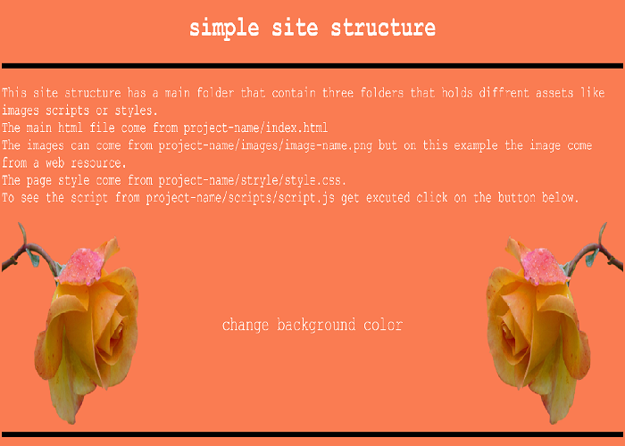

# Html project maker
<div align="center">

</div>

This  script goal is to generate a basic html project in order to save the time of creating the basic project files and folders.<br>After executing the script you should have a project folder with the following structure:

```
📁new_project_1
    📁images
    📁scripts
       script.js
    📁styles
       style.css
    index.html
```

In order to use this script open a console and type the next commands:
```
git clone https://github.com/ip-repo/html_project_maker.git
cd html_project_maker
```
At this point you should be inside the folder <b> html_project_maker</b>.<br>
Here's how to use the script:
```sh
python [entry point file] [project name] [save path] optional[template]
```
- python file: the python entry point.
- project name: name the new project (dont use spaces, use underscore insted).
- save path: the path to save the project to.
- template: 'color' for a more complex html project or 'blank' for a simple one (optional, default is blank).

```sh
python html_maker.py new_project_1 c:\path\to\save\to  #blank as default template
python html_maker.py new_project_2 c:\path\to\save\to color #windows
python html_maker.py new_project_3 /path/to/save/to blank  #linux

```

